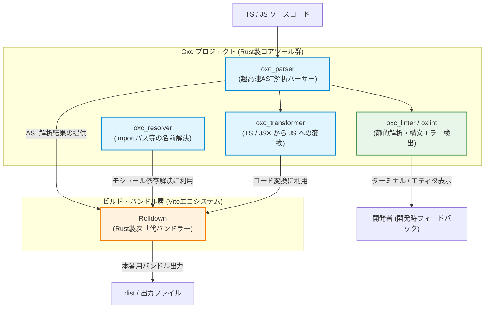

# Oxc（Oxlint/Parser）と Rolldown の関係図・構造解説

Oxc プロジェクト（Rust製のフロントエンドツールチェーン群）と、次世代高速バンドラーである Rolldown の関係性を解説します。

---

## 📐 関係図 (Architecture Diagram)

---

## 🔍 各コンポーネントの役割と関係性

### 1. **oxc_parser (コア解析エンジン)**
*   **役割**: ソースコード（TS/JS/JSX）を読み込み、コンピューターが理解しやすいツリー構造である **AST（抽象構文木）** に変換します。
*   **位置づけ**: すべての Oxc系ツールの「心臓部」であり、極めて高いパフォーマンス（Babel や SWC を凌駕する速度）で動作します。

### 2. **oxc_linter / oxlint (Linter)**
*   **役割**: `oxc_parser` が生成した AST を解析し、バグの種や非推奨の記述（構文・ルール違反）を検出して警告します。
*   **関係性**: コマンドラインツールとして提供されている `oxlint` は、この `oxc_linter` をラップしたユーザー向けツールです。

### 3. **oxc_resolver & oxc_transformer**
*   **oxc_resolver**: `import { foo } from "./bar"` のようなインポートパスが実際のどのファイルを指しているかを高速に解決します。
*   **oxc_transformer**: TypeScript や JSX のコードをブラウザが実行可能なプレーンな JavaScript へ変換します。

### 4. **Rolldown (バンドラー)**
*   **役割**: 依存関係のある複数のファイルを1つ（または少数）のファイルに最適化して結合（バンドル）します。
*   **関係性**:
    *   Rolldown は一からすべてのパーサーやリゾルバーを自作するのではなく、**Oxc プロジェクトが提供する `oxc_parser`、`oxc_resolver`、`oxc_transformer` を内部エンジンとして全面的に採用**しています。
    *   開発主体は主に Vite コアチーム（Evan You 氏ら）ですが、Oxc の作者（Boshen 氏）と緊密に連携しながら共同で開発・最適化が進められています。
