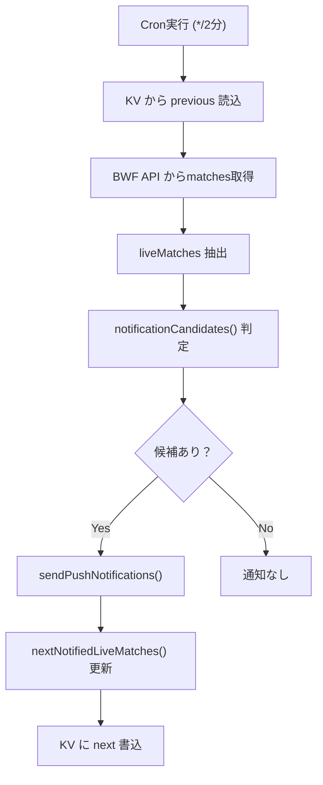

# PWA 通知（Web Push）が届かない問題の調査と修正計画

## 現状と問題の概要

**症状**: iOS Safari ホーム画面版PWAで、テスト通知は届くが実際の試合開始通知が届かない。

**調査結果**:
- Service Worker、マニフェスト、APIエンドポイントはすべて正常応答
- ユニット・結合・レイアウトテスト全71+5+4件パス
- `/api/live` と `/api/status` はデータ取得も正常（ライブ試合2件確認済み）
- テスト通知はクライアントから直接Service Worker経由で表示できている

**根本原因の仮説**: `runNotificationCheck()` の通知候補判定ロジックに問題があり、新規ライブ試合が「送付済み」として扱われてしまう可能性がある。

---

## 通知ロジックの詳細分析



### `notificationCandidates()` の判定ロジック

```typescript
function notificationCandidates(previous, liveMatches) {
    const previousLiveIds = new Set(
        (previous?.matches || [])
            .filter((match) => match.eventType === "live")
            .map((match) => match.id),
    );
    return liveMatches.filter((match) => {
        const attempts = previous?.notificationAttempts?.[match.id] || 0;
        return (
            (attempts > 0 && attempts < MAX_NOTIFICATION_ATTEMPTS) ||
            (!previousLiveIds.has(match.id) &&      // ← 前回もliveだった試合は除外
             !previous?.notifiedLiveMatches?.[match.id])  // ← 送付済みも除外
        );
    });
}
```

### `nextNotifiedLiveMatches()` の問題箇所

```typescript
function nextNotifiedLiveMatches(previous, candidates, notificationAttempts, now) {
    // ...
    // ⚠️ 問題: previous.matchesにライブが含まれている場合、
    // まだ通知を送っていなくてもnotifiedLiveMatchesへ登録してしまう
    for (const match of previous?.matches || []) {
        if (match.eventType === "live" && !previous?.notificationAttempts?.[match.id]) {
            next[match.id] = previous?.checkedAt || now.toISOString();
        }
    }
    // candidatesだけ実際の通知時刻を記録
    for (const match of candidates) {
        if (!notificationAttempts[match.id]) {
            next[match.id] = now.toISOString();
        }
    }
    return next;
}
```

**問題の流れ**:

1. 初回Cron: previous=null → liveMatch "X" が候補になる → 送信試行(sent=0, failed=1) → `notificationAttempts["X"]=1` に記録 → KV書き込み
2. 2回目Cron: previous.matches にライブ "X" がある → `nextNotifiedLiveMatches()` の **上のループ**で `notificationAttempts["X"]=1` なのでこちらでは書かれない（条件: `!previous?.notificationAttempts?.[match.id]`）→ candidatesループで記録される
3. ただし iOS APNs エラー等でfailed=1が続いた場合:  3回目Cron で `attempts=2 < 3` のため候補になる → 3回目以降は attempts=3 に達すると `notifiedLiveMatches` に登録 → 以後は永久に通知されない

**別の経路**: KVに保存したstateに既存のライブ試合がある状態でデプロイや再起動が起きた場合、`notifiedLiveMatches` が空でも `previousLiveIds` に入っているため候補にならず、かつ直後に `nextNotifiedLiveMatches()` で "ledger" として登録される。

---

## 調査で確認が必要な点

> [!IMPORTANT]
> KVに保存されている実際の `push:state` の内容（特に `notifiedLiveMatches` と `notificationAttempts` の状態）を確認する必要があります。CLOUDFLARE_API_TOKEN が設定された環境で `bunx wrangler kv key get "push:state" --binding NOTIFIED_MATCHES --remote` を実行してください。

> [!WARNING]
> iOS APNs (Apple Push Notification service) の問題である可能性があります。iOS17.4+ でWeb Push が利用可能ですが、APNsエンドポイントへの送信が `status=400` 等で失敗している可能性があります。Cloudflare の Worker ログを確認してください。

---

## Open Questions

> [!IMPORTANT]
> 試合開始通知が届かなかったのは最近始まったことですか？それとも当初から届いていませんか？

---

## Proposed Changes

### 1. 通知候補ロジックの改善 (優先度: 高)

現在の問題: `previous.matches` にライブ試合がある場合に、通知未送信でも `notifiedLiveMatches` に登録されてしまう可能性

**調査アプローチ**: まず診断用のログを追加してKV状態を把握する

---

#### [MODIFY] src/api/app.ts

診断ログを追加して何が起きているか確認できるようにする:

```diff
 export async function runNotificationCheck(env, overrides = {}) {
     // ... existing code ...
+    console.log(JSON.stringify({
+        event: "notification-check-debug",
+        previousLiveIds: (previous?.matches || [])
+            .filter(m => m.eventType === "live").map(m => m.id),
+        notifiedLiveMatchIds: Object.keys(previous?.notifiedLiveMatches || {}),
+        notificationAttempts: previous?.notificationAttempts || {},
+        currentLiveIds: liveMatches.map(m => m.id),
+        candidateIds: newMatches.map(m => m.id),
+    }));
     // ...
```

---

### 2. iOS APNs エンドポイント許可の確認

`isAllowedPushEndpoint()` 関数がiOS APNsのエンドポイントを許可しているか確認:

```typescript
// src/api/push.ts
export function isAllowedPushEndpoint(endpoint: string): boolean {
    // ...
    return (
        host === "fcm.googleapis.com" ||
        host === "updates.push.services.mozilla.com" ||
        host.endsWith(".push.services.mozilla.com") ||
        host.endsWith(".push.apple.com") ||   // ← iOS APNs ✅
        host.endsWith(".notify.windows.com")
    );
}
```

APNsは `.push.apple.com` でマッチするため**許可はされている**。

---

### 3. 通知の送受信フローのデバッグ改善 (優先度: 中)

テスト通知が届くことは確認済みなので、サーバーからのPush送信が成功しているかを確認するためのエンドポイントを追加:

#### [NEW] /api/debug/notification-state (開発・デバッグ用)

通知状態を返すAPIを一時的に追加して現状把握:

```typescript
// 実装予定 (本番では認証が必要)
app.get("/api/debug/notification-state", async (c) => {
    const state = await c.env.NOTIFIED_MATCHES.get<StoredState>(STATE_KEY, "json");
    return c.json({
        notifiedLiveMatches: state?.notifiedLiveMatches || {},
        notificationAttempts: state?.notificationAttempts || {},
        liveMatchIds: (state?.matches || [])
            .filter(m => m.eventType === "live").map(m => m.id),
    });
});
```

---

### 4. `nextNotifiedLiveMatches` ロジックの修正 (優先度: 高)

問題の核心: 前回保存時にライブだった試合を `notifiedLiveMatches` 台帳に登録するロジックは、「既存ライブ = 通知済み」という前提だが、**初期デプロイ後の最初のCronで通知を送らずに台帳登録してしまう可能性**がある。

修正方針: `notifiedLiveMatches` への登録は**実際に通知送信を試みた試合のみ**に限定する。既存ライブを台帳に登録するロジックは `notifiedLiveMatches` が存在しない（旧バージョンからの移行）場合のみに限定する。

```diff
 function nextNotifiedLiveMatches(previous, candidates, notificationAttempts, now) {
     const cutoff = now.getTime() - NOTIFICATION_DEDUP_AGE_MS;
     const next = Object.fromEntries(
         Object.entries(previous?.notifiedLiveMatches || {}).filter(([, value]) => {
             const timestamp = Date.parse(value);
             return Number.isFinite(timestamp) && timestamp >= cutoff;
         }),
     );
 
-    // Existing live matches predate this compact ledger and must not be resent.
-    for (const match of previous?.matches || []) {
-        if (match.eventType === "live" && !previous?.notificationAttempts?.[match.id]) {
-            next[match.id] = previous?.checkedAt || now.toISOString();
-        }
-    }
+    // Migration: 旧バージョン（notifiedLiveMatchesを持たない）から移行する場合のみ、
+    // 既存ライブ試合を台帳に登録して再送を防ぐ。
+    if (!previous?.notifiedLiveMatches) {
+        for (const match of previous?.matches || []) {
+            if (match.eventType === "live" && !previous?.notificationAttempts?.[match.id]) {
+                next[match.id] = previous?.checkedAt || now.toISOString();
+            }
+        }
+    }
+
     for (const match of candidates) {
         if (!notificationAttempts[match.id]) {
             next[match.id] = now.toISOString();
         }
     }
     return next;
 }
```

> [!WARNING]
> この変更は既存のKVデータとの互換性に注意が必要です。`notifiedLiveMatches` がすでにKVに存在する場合、migration ロジックは実行されません（正しい動作）。

---

## Verification Plan

### 確認事項の優先順位

1. **まず診断ログを追加してデプロイ** → Cloudflare Logsで次のCron実行結果を確認
2. KVの実際の状態を `wrangler kv key get` で確認
3. 問題が特定できたら修正を実装

### Automated Tests

```bash
# ユニットテスト
bun run test:unit

# 結合テスト
bun run test:integration

# レイアウトテスト
bun run test:layout

# 全件 (precommit前検証)
bun run check && bun run test:layout && bun run dry-run
```

新規追加テスト（結合テスト）:
```typescript
test("sends notification for a newly live match not in the previous ledger", async () => {
    // notifiedLiveMatchesが存在する既存stateで、新規ライブ試合が通知候補になることを確認
    let notificationCalls = 0;
    const dependencies = {
        fetchMatches: async () => [liveMatch],
        sendNotifications: async () => {
            notificationCalls += 1;
            return { sent: 1, failed: 0, removed: 0 };
        },
        now: () => new Date("2026-07-18T00:00:00.000Z"),
    };

    // Simulate state where notifiedLiveMatches exists but doesn't include liveMatch
    await env.NOTIFIED_MATCHES.put("push:state", JSON.stringify({
        checkedAt: "2026-07-17T23:58:00.000Z",
        matches: [],  // no previous live matches
        notifiedLiveMatches: { "other-match": "2026-07-17T00:00:00.000Z" },
    }));

    const result = await runNotificationCheck(env, dependencies);
    expect(result.newMatches).toBe(1);
    expect(notificationCalls).toBe(1);
});
```

### Manual Verification

1. デプロイ後、Cloudflare Workers の Logs で `notification-check-debug` イベントを確認
2. `notifiedLiveMatches` のキーが送信済み試合のみを含むことを確認
3. 試合開始の前後でCronが実行されたとき、`newMatches > 0` となることを確認
4. テスト通知（クライアント側）が引き続き動作することを確認

---

## 現在確認できているスクリーンショット

ローカルPlaywrightテストでのUI状態（APIモック使用）：

- デスクトップ: `/brain/.../layout-desktop.png`
- モバイル 390px: `/brain/.../layout-mobile.png`
- 最小 320px: `/brain/.../layout-minimum.png`
- ワイド 1440px: `/brain/.../layout-wide.png`

UIレイアウトテストは4件全てパス済み。
